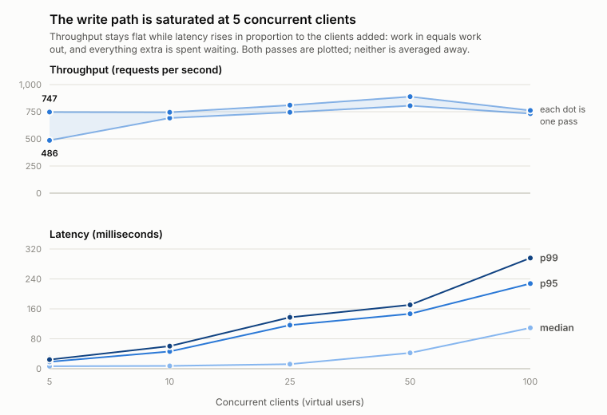

# Banking Ledger

[](https://github.com/nonameTAT/banking-ledger/actions/workflows/ci.yml)   [](LICENSE)

- **[Capacity report](docs/capacity-report.md):** what the service sustains,
  where the ceiling comes from, and the defects load testing found.
- **[Recovery rehearsal](docs/recovery-rehearsal.md):** a real restore, what it
  cost, and the bad dumps now refused.

[](docs/architecture/architecture.drawio.png)

The diagram shows the **target architecture**, the
[architecture document](docs/architecture/architecture.md) explains it.

## Overview

A banking ledger API built with Spring Boot and PostgreSQL. It keeps customer
accounts and moves money between them with double-entry accounting, and it is
built to stay correct under retries, concurrency and failure.

- **Double-entry ledger.** Deposits, withdrawals and transfers each post two
  entries that balance. Entries are never edited. A mistake is corrected by a
  linked reversal.
- **Safe retries.** Every posting carries a caller-chosen `referenceId`.
  Repeating a request returns the original result instead of posting twice.
- **Concurrency-safe balances.** Every balance change takes row locks in a
  fixed order.
- **Per-account access.** Callers sign in through Keycloak. A customer reaches
  only their own accounts; freezing, reversals and reconciliation need an
  administrator.
- **Self-checking.** A scheduled job reconciles every balance against its
  entries. Trace ids, Prometheus metrics and alert rules come with it.
- **Measured operations.** Capacity is load-tested, failure behaviour is
  tested, and backup and restore have been rehearsed.

## Results

What the [capacity report](docs/capacity-report.md) and the
[recovery rehearsal](docs/recovery-rehearsal.md) found:

<picture>
  <source media="(prefers-color-scheme: dark)" srcset="docs/charts/capacity-saturation-dark.svg">
  
</picture>

- **Throughput is flat; latency is not.** In the report's environment, a single
  20 vCPU WSL2 host running the app, PostgreSQL and the k6 load generator
  together, the report's workload sustained roughly 700–800 requests per second
  from 5 to 100 concurrent clients. Each iteration is a deposit, a transfer, an
  account read and a page of entries, against eight funded accounts. Median
  latency rose from 6 ms to 109 ms over the same range. These figures are a
  baseline for comparing changes, not a production promise.
- **The ceiling is one lock.** Every deposit and withdrawal posts against the
  single `SYSTEM-CASH-AUD` account and locks its row, which serialises cash
  movement service-wide. The same workload without writes sustains around 8x
  the throughput.
- **A restore loses recent transactions.** The rehearsed restore took 12
  seconds with about one second of downtime, and lost every transaction posted
  after the backup. The restored ledger reconciles cleanly, so nothing detects
  that loss afterwards. Point-in-time recovery is not implemented.

## Quick Start

You need Docker with Compose, and `openssl` for the token script.

```bash
# Start the app, PostgreSQL and Keycloak, then create demo users:
# alice and bob (customers) and ops (administrator).
docker compose up --build -d --wait
scripts/seed-demo-users.sh

# Sign in as alice. Passwords default to <username>-dev-password.
TOKEN=$(scripts/keycloak-token.sh alice)

# Open an account and keep its id.
ACCOUNT=$(curl -s http://localhost:8080/api/accounts \
  -H "Authorization: Bearer $TOKEN" \
  -H "Content-Type: application/json" \
  -d '{"ownerName": "Alice", "currency": "AUD"}' \
  | sed -E 's/.*"id":([0-9]+).*/\1/')

# Deposit into it. Running this again returns the same transaction instead of
# posting twice, because the referenceId and payload are unchanged.
curl -i http://localhost:8080/api/accounts/$ACCOUNT/deposits \
  -H "Authorization: Bearer $TOKEN" \
  -H "Content-Type: application/json" \
  -d '{"amount": "100.00", "currency": "AUD", "referenceId": "deposit-'"$ACCOUNT"'-1"}'

# Read the ledger entries the deposit posted.
curl -s http://localhost:8080/api/accounts/$ACCOUNT/entries \
  -H "Authorization: Bearer $TOKEN"
```

Every endpoint is described at `http://localhost:8080/swagger-ui.html`. Stop the
stack with `docker compose down`; add `-v` to delete the data, Keycloak users
included. To run the backend alone with locally signed development tokens, see
the header of [`compose.dev-token.yaml`](compose.dev-token.yaml).

## Core Design

### Accounting model

| Posting    | Debit                      | Credit                     |
| ---------- | -------------------------- | -------------------------- |
| Deposit    | System cash account        | Customer account           |
| Withdrawal | Customer account           | System cash account        |
| Transfer   | Source customer account    | Target customer account    |

- **Two entries per transaction.** Every business transaction writes one
  `ledger_transactions` row and two `ledger_entries` rows. Customer accounts
  are liabilities; the system cash account `SYSTEM-CASH-AUD` is an asset. A
  currency is supported only while its `SYSTEM-CASH-<CURRENCY>` account exists,
  so AUD is the only one today.
- **Entries are the truth.** `Account.balance` is a materialized figure kept
  for fast reads. Scheduled reconciliation recomputes every balance from its
  entries and records any difference. It reports differences and never repairs
  them, because a silent fix would destroy the evidence of the defect.
- **History is append-only.** The entity is immutable, the repository has no
  update or delete, and a database trigger rejects `UPDATE` and `DELETE` on
  `ledger_entries`. A mistake is corrected by a reversal: a new transaction
  with mirrored entries, linked to the original, at most once per transaction.

### Consistency

- **Atomic postings.** A posting's transaction, entries, balance changes and
  audit row commit together or not at all.
- **Locking.** Balance changes take pessimistic row locks. Transfers lock the
  lower account id first, so opposing transfers cannot deadlock.
- **Idempotent retries.** The ledger stores a fingerprint of the payload with
  each `referenceId`. An identical retry returns the original result,
  including the balance recorded at the time. A different payload under the
  same id is refused with `409 IDEMPOTENCY_PAYLOAD_MISMATCH`. Concurrent
  duplicates queue on a lock, so exactly one posts.
- **Bounded failure.** Connection, transaction and statement timeouts nest, so
  nothing waits indefinitely. A datastore failure answers
  `503 DATABASE_UNAVAILABLE` with a trace id, and a retry with the same
  `referenceId` posts exactly once.

The [architecture document](docs/architecture/architecture.md#53-service-layer)
and the [API reference](docs/api.md) have the details.

### Authentication and authorization

Every request needs a bearer token, except the OpenAPI documents. Tokens are
verified here, never issued: Keycloak is the only issuer, and users sign in
with Authorization Code and PKCE. The app checks each token's issuer and
audience and reads the caller's roles from its `ledger_roles` claim. An account
belongs to the identity, the token's `sub`, that opened it.

| Operation                       | Permitted caller                                  |
| ------------------------------- | ------------------------------------------------- |
| Create an account               | Any authenticated caller, who becomes its owner   |
| List accounts                   | Own accounts; administrators see every account    |
| Read an account, entries, audit | Owner or administrator                            |
| Deposit, withdraw               | Owner or administrator                            |
| Transfer                        | Owner of the **source** account, or administrator |
| Freeze, unfreeze, reverse       | Administrator only                                |
| Reconciliation runs and results | Administrator only                                |

A transfer reports only the source account's balance, since paying into an
account is no permission to read it. A caller asking for someone else's account
gets `403` rather than `404`, which confirms that the id exists. The token
contract, the Keycloak realm and the development tokens are described in
[section 4 of the architecture document](docs/architecture/architecture.md#4-identity-authentication-and-authorization).

### Observability

- **Tracing:** every request's trace id is returned in `X-Trace-Id`, in error
  bodies, and on each of its log lines.
- **Metrics:** `banking_*` series for failed transactions, datastore failures
  and reconciliation, at `/actuator/prometheus`, each published at zero from
  startup so the first failure is visible.
- **Reconciliation:** every run is stored, clean or not, and is queryable
  under `/api/reconciliation`.
- **Alerts:** rules in [`ops/prometheus/alerts.yml`](ops/prometheus/alerts.yml);
  `docker compose --profile observability up` adds Prometheus.

## Architecture & Stack

The target architecture is pictured [at the top](#banking-ledger) and explained
in the [architecture document](docs/architecture/architecture.md).

| Area       | Stack                                                                           |
| ---------- | ------------------------------------------------------------------------------- |
| Backend    | Java 25, Spring Boot 4.1 (Web MVC, Data JPA / Hibernate, Validation), Maven     |
| Database   | PostgreSQL 17, with the schema owned by Flyway migrations                       |
| Security   | Spring Security OAuth2 resource server (JWT), Keycloak (OpenID Connect)         |
| Operations | Docker Compose, Actuator, Micrometer with Brave tracing, Prometheus, k6         |
| Testing    | JUnit 6, Testcontainers, GitHub Actions                                         |

```text
src/main/java/com/owo/banking_ledger
├── account, deposit, withdrawal, transfer, reversal   # the money-moving APIs
├── ledger, audit, reconciliation                      # entries, audit logs, balance checks
├── security, observability, common                    # access, tracing and metrics, errors
src/main/resources/db/migration                        # Flyway migrations
ops                                                    # Keycloak realm, Prometheus rules, k6 scripts
scripts                                                # backup, restore, demo users, tokens
```

## Testing

```bash
./mvnw test
```

Tests need a running Docker daemon and nothing else: every integration test
gets a throwaway PostgreSQL container from Testcontainers, migrated by the same
Flyway scripts the application ships. CI runs the suite on every push to `main`
and on pull requests, then builds the container image without publishing it.

The tests are written around the risks a ledger carries:

- **History cannot change:** direct `UPDATE` and `DELETE` on posted entries are
  refused by the database.
- **Retries post once:** replays, mismatched payloads, and concurrent
  duplicates.
- **Concurrency:** simultaneous withdrawals and transfers, double reversals,
  and contention on a customer's own account.
- **Failure mid-request:** a fault injected into the table a real deposit or
  transfer is about to write, then the response, the full rollback, and a retry
  that posts exactly once.
- **Datastore failures:** statement timeouts, killed connections, real
  deadlocks and a stopped database, each failing quickly and classified.
- **Access:** customers turned away from other customers' accounts, and tokens
  with the wrong issuer, audience or signing key rejected.
- **Monitoring:** metrics present before the first failure, and real balance
  drift detected and reported by reconciliation.

## Documentation

- [Architecture](docs/architecture/architecture.md): the target architecture,
  request paths, identity and the token contract, the client contract, and the
  planned work
- [API reference](docs/api.md): every endpoint, error code and validation rule;
  also served live at `/swagger-ui.html` and `/v3/api-docs`
- [Capacity report](docs/capacity-report.md) and
  [recovery rehearsal](docs/recovery-rehearsal.md): the measurements behind
  [Results](#results)

## License

Released under the [MIT License](LICENSE).
