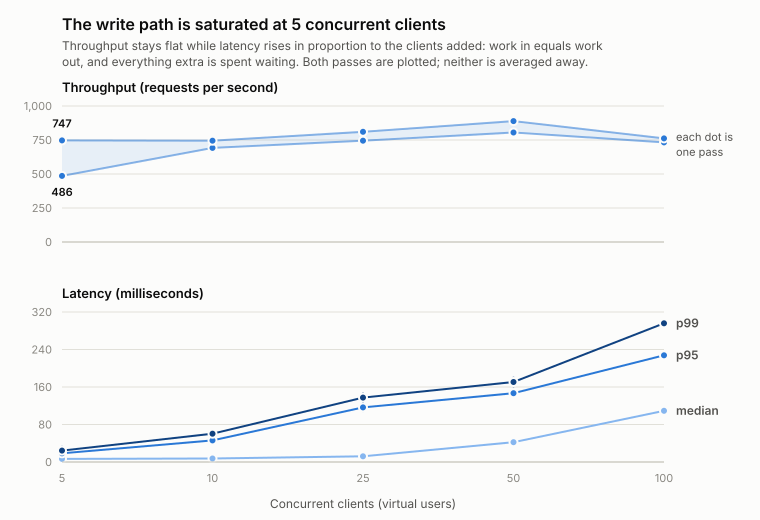
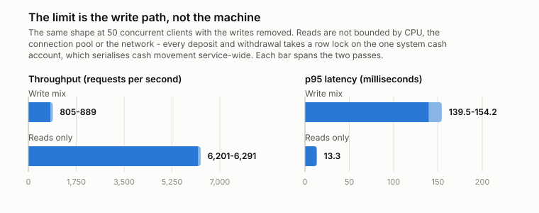
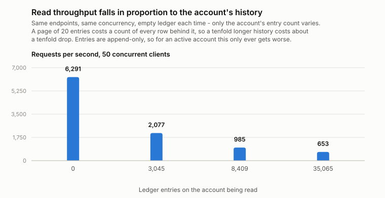

# Capacity report

What the ledger sustains, measured rather than estimated. Re-run with
`ops/load/ledger-load.js`; the method is below, and reading it first matters
more than usual here, because two of the results are mostly a statement about
what was held still.

## Environment

These numbers describe this hardware and this deployment shape. They are a
baseline to compare against after a change, not a promise about production.

| | |
| --- | --- |
| Host | 20 vCPU, 8 GB RAM, WSL2 (kernel 6.6.87.2) |
| Deployment | Docker Compose: one application container, one PostgreSQL 17.10 container |
| Runtime | Temurin 25.0.4, Spring Boot 4.1 |
| Connection pool | HikariCP, max 20 |
| Load generator | k6 v2.2.0, on the same host as the service |

The load generator sharing a host with the service is the largest caveat here:
it competes for the same CPU, so these figures understate what the service would
do with the generator elsewhere.

## Method

**Only the hold window is measured.** The run climbs to the target concurrency
over 10 seconds, holds it for 30, then winds down over 10. k6's own summary
aggregates all three, and a figure taken from that is an average over every
concurrency between one and the target — not the throughput at the target. Every
request is therefore tagged with the part of the run that issued it, and the
summary reports the hold window separately, with the whole-run figure printed
alongside and labelled as what it is. See `ops/load/phases.js`.

The difference is not cosmetic. At 10 concurrent clients one run measured
776 req/s over the hold window and 634 req/s over the whole run; at 25 the two
were 687 and 679. The whole-run figure moves with how long the ramp is, which is
a property of the test rather than of the service.

The figures below are generated from the tables in this document by
`docs/charts/plot.py`, which needs no packages beyond the standard library.

Three other things are held still, because each of them moves the result by more
than the effect being measured:

- **The ledger starts empty.** Every run truncates the ledger and opens eight
  freshly funded accounts first. Read cost grows with account history, badly
  enough to dominate everything else — see below — so runs against a ledger that
  has been accumulating are not comparable with each other, let alone with a
  fresh one.
- **Scheduled reconciliation is off**, via
  `BANKING_RECONCILIATION_SCHEDULED=false`. It scans every account's entries
  every five minutes, so whether it lands inside a 30-second window is luck,
  and it costs around 10% of throughput when it does.
- **The JVM is warm.** One discarded run precedes the series. A cold run shows
  multi-second outliers in `max` that never recur.

## Write mix

One iteration is a deposit, a transfer, an account read, and a page of ledger
entries, run against a pool of 8 funded accounts. Deposits and transfers are the
expensive part: each takes row locks, writes a transaction, two ledger entries,
and an audit row.

Two full passes, because one is not enough to tell a difference from noise:

Each cell is pass A / pass B; throughput in req/s, latency in ms.

| VUs | Throughput | median        | p95           | p99           |
| -----| ------------| ---------------| ---------------| ---------------|
| 5   | 747 / 486  | 6.0 / 7.1     | 12.0 / 25.1   | 15.5 / 33.0   |
| 10  | 692 / 745  | 7.1 / 7.7     | 50.2 / 41.8   | 65.5 / 55.1   |
| 25  | 745 / 810  | 12.2 / 12.0   | 124.7 / 108.3 | 147.1 / 127.7 |
| 50  | 805 / 889  | 44.6 / 40.0   | 154.2 / 139.5 | 180.5 / 160.9 |
| 100 | 732 / 762  | 111.0 / 107.5 | 232.3 / 223.1 | 296.5 / 295.4 |

<picture>
  <source media="(prefers-color-scheme: dark)" srcset="charts/capacity-saturation-dark.svg">
  
</picture>

No request failed at any level, in either pass.

**Throughput is flat at roughly 700–800 requests per second from 5 concurrent
clients to 100.** Latency, meanwhile, scales almost exactly with the concurrency
added: the median goes 6 ms → 7 ms → 12 ms → 42 ms → 109 ms as clients go
5 → 10 → 25 → 50 → 100, close to a straight multiple. Work in equals work out
with everything extra spent waiting, which is a queue in front of a saturated
resource rather than capacity being taken up. **The write path is already
saturated at 5 concurrent writers, and sizing this deployment above that buys
latency, not throughput.**

That nothing failed is the other half of the result: the ceiling shows up as
waiting, not as errors.

**On the precision of these numbers.** Throughput at a fixed concurrency varies
by up to 15% between identical runs on this host — 5 VUs came out at 747 and
then 486 — while the latency percentiles repeat to within about 10%. So latency
here is a measurement and throughput is a band. A single pair of runs cannot
rank two concurrency levels, and any claim of the form "throughput peaks at N
clients" needs more than one pass to survive; an earlier version of this report
made exactly that claim from single runs, and the peak it named was inside the
noise.

## Where the ceiling comes from

The same shape with the writes removed, at the same concurrency and from the
same empty ledger:

| 50 VUs | Throughput | median | p95 | p99 |
| --- | --- | --- | --- | --- |
| Write mix | 805–889 req/s | 40–45 ms | 140–154 ms | 161–181 ms |
| Reads only | 6,201–6,291 req/s | 6.6 ms | 13.3 ms | 17.8 ms |

<picture>
  <source media="(prefers-color-scheme: dark)" srcset="charts/read-vs-write-dark.svg">
  
</picture>

Reads sustain around 8x the throughput at a sixth of the latency, so the limit
is not CPU, the connection pool, or the network. It is the write path.

Every deposit and withdrawal posts against the single seeded system cash
account, `SYSTEM-CASH-AUD`, and takes a row lock on it. That one row serialises
cash movement across the whole service regardless of how many accounts or
clients exist. It is a deliberate consequence of double-entry bookkeeping
against one cash account, and it is the first thing to address if this ceiling
ever matters: the usual approach is to shard the cash account into several rows
and pick one per transaction, so contention spreads.

## Read throughput falls as the ledger grows

The read baseline above is from an empty ledger, and that is the only reason it
is a large number. Reads at 50 VUs against the same endpoints, varying only how
much history the accounts have:

| Entries on the account being read | Throughput | median | p95 |
| --- | --- | --- | --- |
| 0 | 6,291 req/s | 6.6 ms | 13.3 ms |
| 3,045 | 2,077 req/s | 20.6 ms | 45.3 ms |
| 8,409 | 985 req/s | 44.3 ms | 95.6 ms |
| 35,065 | 653 req/s | 67.8 ms | 143.2 ms |

<picture>
  <source media="(prefers-color-scheme: dark)" srcset="charts/read-throughput-vs-history-dark.svg">
  
</picture>

**Throughput falls roughly in inverse proportion to the account's entry count.**
A tenfold longer history costs about a tenfold drop, and at 35,000 entries the
read path is no faster than the write path it was supposed to be the baseline
for.

The cause is the page count. `LedgerQueryService.findAccountEntries` returns a
`Page`, and Spring Data answers a `Page` with a second query counting every row
matching the filter, so serving 20 entries counts all of them:

```text
Aggregate  (actual time=4.299..4.300 rows=1 loops=1)
  ->  Index Only Scan using idx_ledger_entries_account_id on ledger_entries
        Index Cond: (account_id = 2)
        (actual time=0.050..3.134 rows=35065 loops=1)
```

That is 4.3 ms of pure scan per request at 35,065 entries, against 0.8 ms at
8,409 — the index keeps it off the heap but not off the CPU, and it grows
without bound as the account transacts. Ledger entries are append-only, so this
only ever gets worse for an active account.

The fix is to stop counting: keyset pagination (`WHERE id < :cursor ORDER BY id
DESC LIMIT :size`) answers the same question in constant time, at the cost of
the total page count in the response. That is the change to make before any
account accumulates real history.

## A defect this found

The first run failed 30.74% of requests. All of them were
`ObjectOptimisticLockingFailureException`, answered as `503` and counted as
`other` database failures.

The cause was not load. The ownership check added for authentication loaded the
account entity before the balance-changing code took its pessimistic lock, so
Hibernate served that cached copy, and its by-then-stale `@Version`, to the
locking read. Under contention another transaction committed in between and the
version check failed at flush.

It had been invisible because **every concurrency test in the suite ran as an
administrator, and an administrator skips the ownership check entirely.** The
contended customer path had never been exercised. The same load with an
administrator token passed 25,984 requests without a single failure, which is
what confirmed it.

The check now reads ownership through a projection instead of loading the
entity, and `FailureHandlingIntegrationTest` covers the contended path as the
account's owner. Every figure above is from after the fix.

## Running it

```bash
docker compose up -d --build

TOKEN=$(TOKEN_TTL_SECONDS=7200 scripts/dev-token.sh alice)
# Create and fund a few accounts as that same subject, then pass their ids:
docker run --rm --network host -v "$PWD/ops/load:/scripts:ro" \
  -e BASE_URL=http://localhost:8080 \
  -e TOKEN="$TOKEN" \
  -e ACCOUNT_IDS=2,3,4,5,6,7,8,9 \
  -e VUS=25 -e RAMP_UP=10s -e HOLD=30s -e RAMP_DOWN=10s \
  grafana/k6:latest run /scripts/ledger-load.js
```

Mount the whole `ops/load` directory, not just the one script: both scripts
import `phases.js` from beside them.

Read the **STEADY STATE** block of the summary. The **WHOLE RUN** block is
printed underneath it on purpose, so that the number nobody should quote is
visible next to the one they should, rather than being the only one there.

The run fails if any deposit is rejected, if any request fails, or if p95 over
the hold window exceeds one second, so it is usable as a check and not only as a
measurement. Latency is judged on the hold window; correctness over the whole
run, because a request answered wrongly during the ramp is still wrong.

To reproduce the table above rather than just take a reading, hold still what
the Method section holds still: empty the ledger first, disable scheduled
reconciliation, discard one warm-up run, and do at least two passes.
